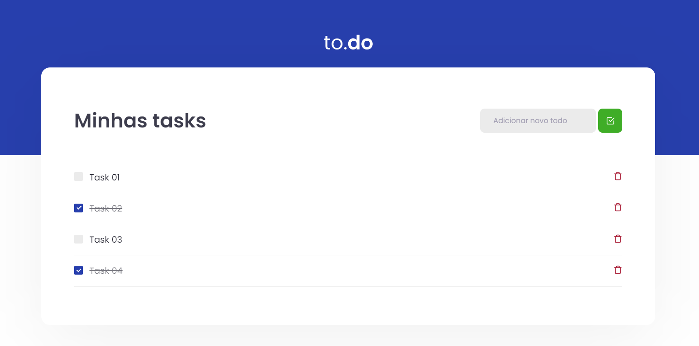

<div align="center">
  
</div>

<h1 align="center"> RocketSeat 🔥 Ignite ReactJS </h1>

<h2 align="center"> Desafio 01 : Conceitos do React ( Projeto Todo List ) </h2>

<p align="center">
  <a href="https://rocketseat.com.br">
    
  </a>
</p>

## 🚀 Sobre o Projeto
Este projeto é uma aplicação onde o seu principal objetivo é uma pequena aplicação de atividades a fazer.

- Adicionar uma nova tarefa
- Remover uma tarefa
- Marcar e desmarcar uma tarefa como concluída   

## ✅ Imagens do Projeto

<div align="center">
    
   </br>
</div>

## 🧰 Tecnologias Utilizadas
* VSCode ( IDE )
* ReactJS
* Jest
* HTML
* TypeScript
* SASS
* JavaScript

## ⚙️ Rodando o Projeto
```bash
# Crie uma pasta 
$ mkdir react-ignite-components

# Clone este repositório para a pasta anterior
$ git clone https://github.com/LeonardoMarquesDias/todo-reactjs.git
# ou use a opção de download.

# Instale as dependências
$ yarn install
ou
$ npm install

# Executando o Projeto
$ yarn dev 
ou
$ npm dev

# Acesse http://localhost:8080 no seu navagador
```
## 🌐 Referências

[Desafio 01 - TodoList](https://www.notion.so/Desafio-01-Conceitos-do-React-51e4099a6e2f4d4bae94f9fe75bb769d) - Notion com todas as informações.

<br>

## 📝 Licença

Esse projeto está sob a licença MIT. Veja o arquivo [LICENSE](/LICENSE) para mais detalhes.

---

[Leonardo](https://github.com/LeonardoMarquesDias) 😁


